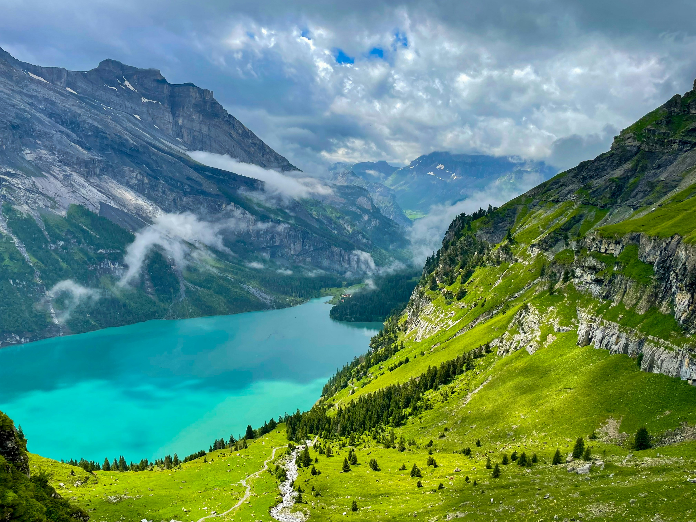
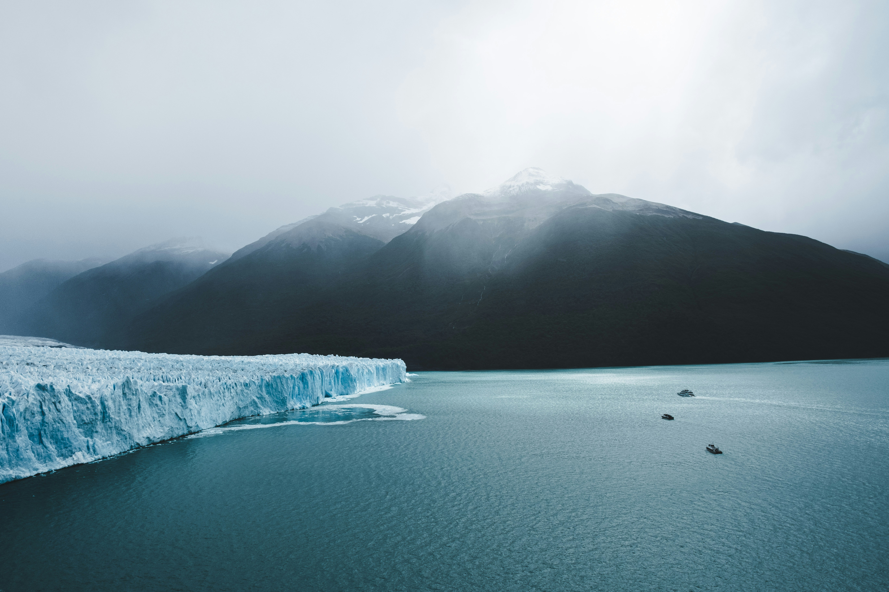

# Hero images

Place your landing hero images here.

Recommended sizes:
- Top card (Dolomites): 1600×600 (or wider) JPG/WEBP, landscape, safe margins left/right.
- Middle/bottom cards: 1400×480 and 1400×520 respectively work well.

Usage:
- Save your Dolomites photo as `public/hero/dolomites.jpg`.
- Switzerland as `public/hero/switzerland-2.jpg` (or update the code to match your filename).
- Patagonia as `public/hero/patagonia.jpg`.

Repositioning (focal point):
- Edit `src/app/page.tsx` and tweak the `heroObjectPos` values, e.g. `dolomites: 'center 30%'`.
- The first value controls horizontal (left/center/right), the second controls vertical (%) from the top.
- Example: `'center 20%'` moves the focus higher to keep peaks visible in a short card height.

Notes:
- Images in `public/` don’t require a server restart.
- Keep file sizes < 400 KB if possible; export as WEBP for best performance.
